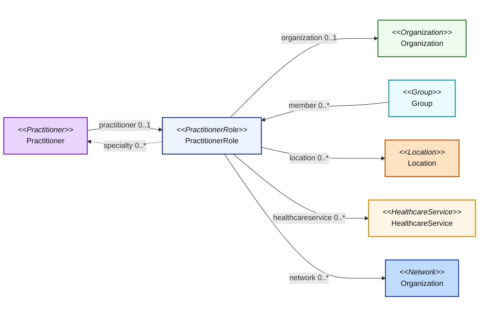

### NDH Resources and Relationships
The NDH IG contains the following resources, which are based on FHIR R4 base 4.0.1 and US Core 6.1.0. 
- Endpoint: The technical details of an endpoint that can be used for electronic services
- HealthcareService: The details of a healthcare service
- InsurancePlan: Details of a Health Insurance product/plan provided by an organization
- Location: Details and position information for a physical place
- Network (based on Organization): A healthcare provider insurance network
- Organization: An organization is a formal or informal grouping of people or organizations with a common purpose
- OrganizationAffiliation: Details of relationships between two or more organizations
- Practitioner: A practitioner is a person who is directly or indirectly involved in the provisioning of healthcare
- PractitionerRole: Describes the relationship between a practitioner and an organization. A practitioner provides services to the organization at a location. Practitioners also participate in healthcare provider insurance networks through their role at an organization
- Verification (based on VerificationResult): Provide information on which verification process was performed, what was verified, when the verification took place, who performed the verification, and how it was verified for a given instance of a resource

### Overview of NDH - Resource Relationships
Note: the following diagrams provide a high-level view of the relationships between resources used in this IG. They do not necessarily reflect all of the relationships/references between resources.

#### All Resource Relationships 1
A high-level view of the relationships between resources. 
In the NDH resource profiles, there is no inherent relationships. Both Organizations and OrganizationAffiliations can declare a network relationship. Consider a scenario where an OrganizationAffiliation, which is part of a Network, is associated with a PractitionerRole through the Organization. This relationship is not automatically inherited by the PractitionerRole. The PractitionerRole must have its own direct link to the Network. Likewise, any network affiliation declared by a PractitionerRole is not automatically inherited by the organization.

<figure>
    
    <figcaption></figcaption>
</figure>  
 

#### All Resource Relationships 2  
All resources reference the Endpoint resource.
<figure>
    
    <figcaption></figcaption>
</figure>  
 

#### Practitioner Role Relationships  
PractitionerRole describes the relationship between a practitioner and an organization. A practitioner provides services to the organization at a location. Practitioners also participate in healthcare provider insurance networks through their role at an organization.

#### Organization Affiliation Relationships  
Similar to PractitionerRole, OrganizationAffiliation describes relationships between organizations. For example: 
1. The relationship between an organization and an association it is a member of (e.g., hospitals in a hospital association)
2. An organization that provides services to another organization, such as an organization contracted to provide mental health care for another organization as part of a healthcare provider insurance network
3. Distinct organizations forming a partnership to provide services (e.g., a cancer center)
<figure>
    
    <figcaption></figcaption>
</figure>
 

#### Network / Insurance Plan Relationships  
A network is a group of practitioners and organizations that provide healthcare services for individuals enrolled in a health insurance product/plan (typically on behalf of a payer).
<figure>
    
    <figcaption></figcaption>
</figure>
 

